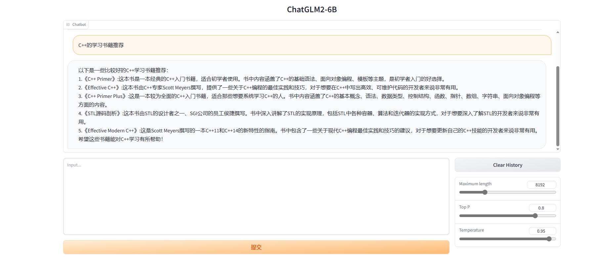

# susu-ChatGLM2-6B

如何对 [ChatGLM2-6B](https://github.com/THUDM/ChatGLM2-6B) 进行微调。

## 介绍

[ChatGLM-6B](https://github.com/THUDM/ChatGLM-6B) 是一个开源的、支持中英双语的对话语言模型，基于 General Language Model (GLM) 架构，具有 62 亿参数。结合模型量化技术，用户可以在消费级的显卡上进行本地部署（INT4 量化级别下最低只需 6GB 显存）。 ChatGLM-6B 使用了和 ChatGPT 相似的技术，针对中文问答和对话进行了优化。经过约 1T 标识符的中英双语训练，辅以监督微调、反馈自助、人类反馈强化学习等技术的加持，62 亿参数的 ChatGLM-6B 已经能生成相当符合人类偏好的回答。

[2023.06.25]二代模型 ChatGLM2-6B 模型开源，更强大的性能（MMLU [+23%]、C-Eval [+33%]、GSM8K [+571%] ）、更长的上下文（2K扩展到8K）、更高效的推理（推理速度提升42%）、更开放的开源协议。

官方推荐的微调教程: https://www.heywhale.com/mw/project/64984a7b72ebe240516ae79c .

## 安装

1. 创建虚拟环境:

```shell
python -m venv env
source env/bin/activate
which python
```

2. 使用 pip 安装依赖:

```shell
pip install --upgrade pip
pip install -r requirements.txt -i https://pypi.tuna.tsinghua.edu.cn/simple
```

## 初步使用

1. [快速开始](./quick_start.ipynb): 需要安装 jupyter (`pip install jupyter`).

2. 网页版 Demo 使用:

```shell
python web_demo.py
```



3. 命令行 Demo 使用（输入 clear 可以清空对话历史，输入 stop 终止程序）:

```shell
python cli_demo.py
```

---

```shell
$ python cli_demo.py
Loading checkpoint shards: 100%|██████████████████████████████████████████████████████████| 7/7 [00:07<00:00,  1.06s/it]欢迎使用 ChatGLM2-6B 模型，输入内容即可进行对话，clear 清空对话历史，stop 终止程序

用户：你好

ChatGLM：你好👋！我是人工智能助手 ChatGLM2-6B，很高兴见到你，欢迎问我任何问题。

用户：C++的学习书籍推荐

ChatGLM：以下是一些经典的 C++ 学习书籍推荐：

1. 《C++ Primer》（第 5 版），Stephen Prata：这是一本适合初学者和进阶者的经典 C++ 入门书籍，覆盖了 C++ 的基础知识、面向 对象编程、模板等主题。书中有许多例子和练习题，对于初学者来说很有帮助。

2. 《Effective C++》（第 3 版），Scott Meyers：这本书是一本关于 C++ 编程风格的指南，通过一些实用的技巧和规则，帮助读者提高代码的可读性、可维护性和性能。

3. 《C++ Primer Plus》（第 6 版），Stephen Prata：这是一本较为全面的 C++ 入门书籍，适合那些想要系统学习 C++ 的人。书中包括 10 个章节，涵盖了 C++ 的基础知识、语法、数据类型、控制结构、函数、指针、数组、字符串、面向对象编程等方面的内容。

4. 《STL源码剖析》 ，侯捷：这本书深入讲解了 C++ 标准库中的常用模板类和函数，对于想要深入了解 C++ 模板编程的人来说是一本 非常有用的书籍。

5. 《Effective Modern C++》，Scott Meyers：这是 Meyers 的一本新书，重点讨论了 C++ 11 和 C++14 的新特性，包括 Lambda 表达式、智能指针、移动语义、并发编程等。这本书适合进阶 C++ 开发者。

这些书籍都是非常好的学习 C++ 的资源，你可以根据自己的需求和水平选择适合自己的一本或多本书籍。

用户：stop
$
```

## API 部署

1. 安装依赖:

```shell
pip install fastapi uvicorn
```

2. 开启服务:

```shell
python api.py
```

3. 默认部署在本地的 8000 端口，通过 POST 方法进行调用:

```shell
curl -X POST "http://127.0.0.1:8000" \
     -H 'Content-Type: application/json' \
     -d '{"prompt": "你好", "history": []}'
```

4. 得到的返回值为:

```shell
{
  "response":"你好👋！我是人工智能助手 ChatGLM2-6B，很高兴见到你，欢迎问我任何问题。",
  "history":[["你好","你好👋！我是人工智能助手 ChatGLM2-6B，很高兴见到你，欢迎问我任何问题。"]],
  "status":200,
  "time":"2023-03-23 21:38:40"
}
```

## 参考

[1] [ChatGLM-6B](https://github.com/THUDM/ChatGLM-6B)

[2] [ChatGLM-6B博客](https://chatglm.cn/blog)

[3] [ChatGLM2-6B](https://github.com/THUDM/ChatGLM2-6B)

[4] [ChatGLM2-6B 的部署与微调教程](https://www.heywhale.com/mw/project/64984a7b72ebe240516ae79c)